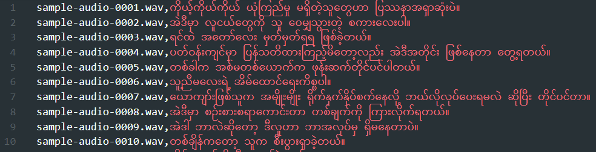
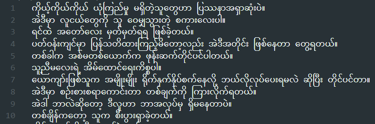

# Data Preparation Toolkit for TTS

## Description

This toolkit is intended to help preparing data for several machine learning projects, albeit only containing three separate programs for data preparation for text-to-speech projects. They are

- renaming program (`rename.py`)
- formatting program (`format.py`)
- corpus creation program (`corpus.py`)

A small dataset is already provided as a sample for these programs to test with, where

- dataset/wavs contains audio files
- dataset/script.txt contains scripts for the audio files

## License

<a rel="license" href="http://creativecommons.org/licenses/by-nc-sa/4.0/"></a>

This work is licensed under a
Creative Commons Attribution-NonCommercial-ShareAlike 4.0 International License.

While you are permitted to use, share and adapt this tool in any reasonable manner, you may not use it for commercial purposes. View detailed info of the [license](https://creativecommons.org/licenses/by-nc-sa/4.0/)

## rename.py

### Purpose

This program is for renaming every file inside a directory according to a particular **naming convention**. It also allows to alter the extension of all files to be renamed.

### Usage

`python rename.py -d DIRECTORY -n BASE_NAME -e EXTENSION`

- `DIRECTORY` - Directory holding files to be renamed
- `BASE_NAME` - Beginning name of every file (followed by a different number to assign a unique name to each of them)
- `EXTENSION` - Extension (file type) of all files

For example, running the following code will ensure every file inside the given directory (_dataset/wavs_) has the given base name (_sample-audio_) and the given file type (_wav_).

`python rename.py -d dataset/wavs -n sample-audio -e wav`

The result will be

```
sample-audio-0001.wav
sample-audio-0002.wav
sample-audio-0003.wav
sample-audio-0004.wav
sample-audio-0005.wav
...
...
```

## format.py

### Purpose

This program is to output a **CSV file containing a `<audio, text>` pair in each entry** as shown below. This file is used to generate training data for text-to-speech projects.



### Usage

`format.py [-h] -i INPUT_SCRIPT -d DATASET_DIRECTORY [-o OUTPUT] [-se START_ENTRY] [-ee END_ENTRY] [-s SHUFFLE]`

- `INPUT_SCRIPT` - Script file containing a sentence at each entry
- `DATASET_DIRECTORY` - Directory where audio files reside
- `OUTPUT` - CSV file containing a pair of audio file path and its respective script at each entry. (metadata.csv by default)
- `START_ENTRY` - Audio index where the dataset begins for splitting the dataset (0 by default)
- `END_ENTRY` - Audio index where the dataset ends for splitting the dataset (-1 by default)
- `SHUFFLE` - Shuffle the entries (False by default)

For example, running the following code will pair the file path of each file inside given directory (_dataset/wavs_) with its respective script present in the given script file (_dataset/script.txt_) and output the pairs inside a CSV file.

`python format.py -i dataset/script.txt -d dataset/wavs`

## corpus.py

### Purpose

This program is to output a plain text file where an entry is just a single sentence as shown below. This file is to provide text for syllable segmentation programs to extract syllables, and is intended to be generated from the metadata CSV file, which is for text-to-speech data. Hence, it can also be regarded as the reversal of `format.py`.



### Usage

`corpus.py -i INPUT [-o OUTPUT]`

- `INPUT` - CSV file containing a pair of audio file path and its respective script at each entry
- `OUTPUT` - Plain text file containing only a sentence at each entry (corpus.txt by default)

For example, running the following code will output a plain text file where audio file paths from the given metadata CSV file (_metadata.csv_) are stripped.

`python corpus.py -i metadata.csv`
